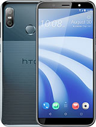
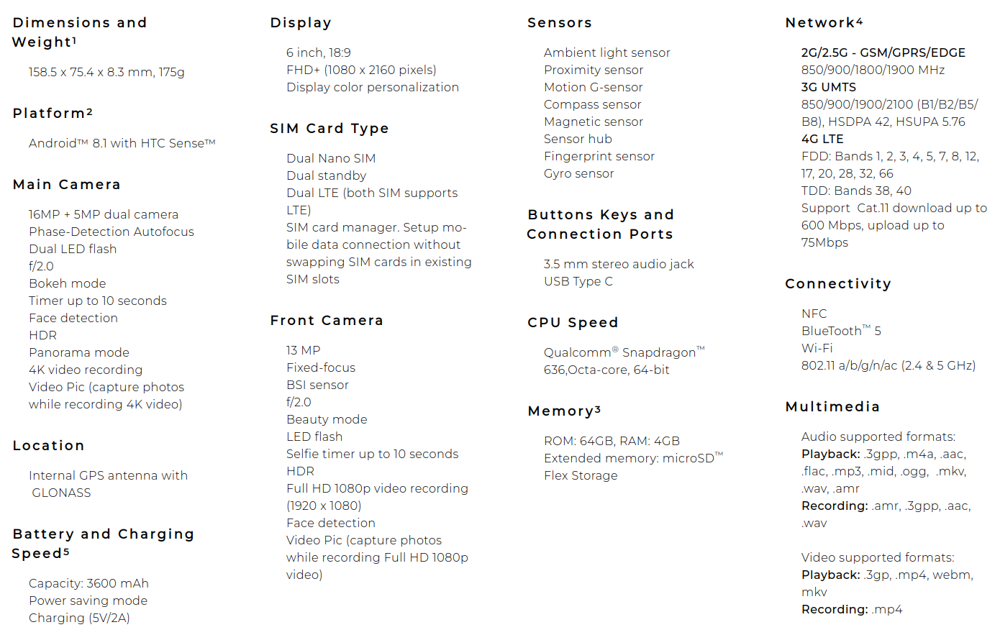

## Device tree for building twrp for HTC U12 Life

The HTC U12 Life (codenamed _"htc_iml"_) is a mid-range smartphone from HTC announced in August 2018.

## Device specifications

 | Device                    | HTC U12 Life
 --------------------------- | :----------------------------------------------------------------------------------------------------------------|
 | SoC                       | Qualcomm SDM636 Snapdragon 636                                                                                   |
 | CPU                       | Quad-Core 1.8 GHz Kryo 260 Gold & Quad-Core 1.6 GHz Kryo 260 Silver                                              |
 | GPU                       | Adreno 509                                                                                                       |
 | Memory                    | 4/6 GB RAM                                                                                                       |
 | Shipped Android Version   | 11.0                                                                                                             |
 | Storage                   | 64/128 GB (eMMC 5.1)                                                                                             |
 | MicroSD                   | microSDXC (uses shared SIM slot)                                                                                 |
 | Battery                   | Non-removable Li-Ion 3600 mAh                                                                                    |
 | Dimensions                | 158.5 x 75.4 x 8.3 mm                                                                                            |
 | Display                   | 1080 x 2160 pixels, 6.0 inches (~402 ppi density) FHD+                                                           |
 | Camera                    | Rear - Primary 16 MP f/2.0 (PDAF), Secondary 5 MP, f/2.4 (depth), Dual LED flash, Front - 13 MP f/2.0, LED Flash |

